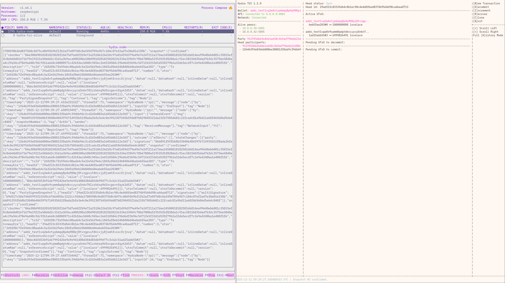
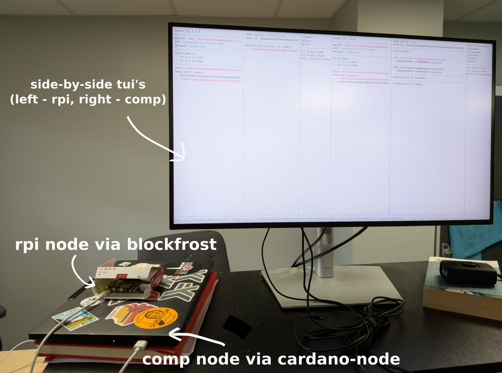

# hydra-blockfrost-rpi-demo

This is a small process-compose based Nix project configures:

1. A hydra-node,
2. The hydra-tui.

The peers are expected to be provided in the `./peers` folder in the following
way:

```shell
> tree peers
peers
├── noon
│   ├── cardano.vk
│   ├── hydra.vk
│   └── peer
└── protocol-parameters.json
```

Your credentials are expected to be provided in `../credentials`:

- `fuel.sk` - to pay for L1 transactions
- `funds.sk` - to bring L1 funds into the Head
- `hydra.sk` - to sign hydra transactions


### Configuration

You will also want to configure these values in `demo.nix`:

```
...
publicIp = "10.0.0.30";
hydraPort = "5001";
peers = [ "noon" ]; # List of peers you wish to connect to from your "./peers" folder
...
```

And, finally, you of course need a blockfrost project key in a file named
`blockfrost-project.txt`.


### Running

```
nix run .#rpi -- --theme "Catppuccin Latte"
```

### Trivia

This project is expected to be run with a companion hydra-node somewhere else.
For this purpose you may enjoy
[cardano-scaling/hydra-head-process-compose](https://github.com/cardano-scaling/hydra-head-process-compose)
which defines a process-compose-based hydra-node setup through but this time
using the cardano-node.


### Screenshots



